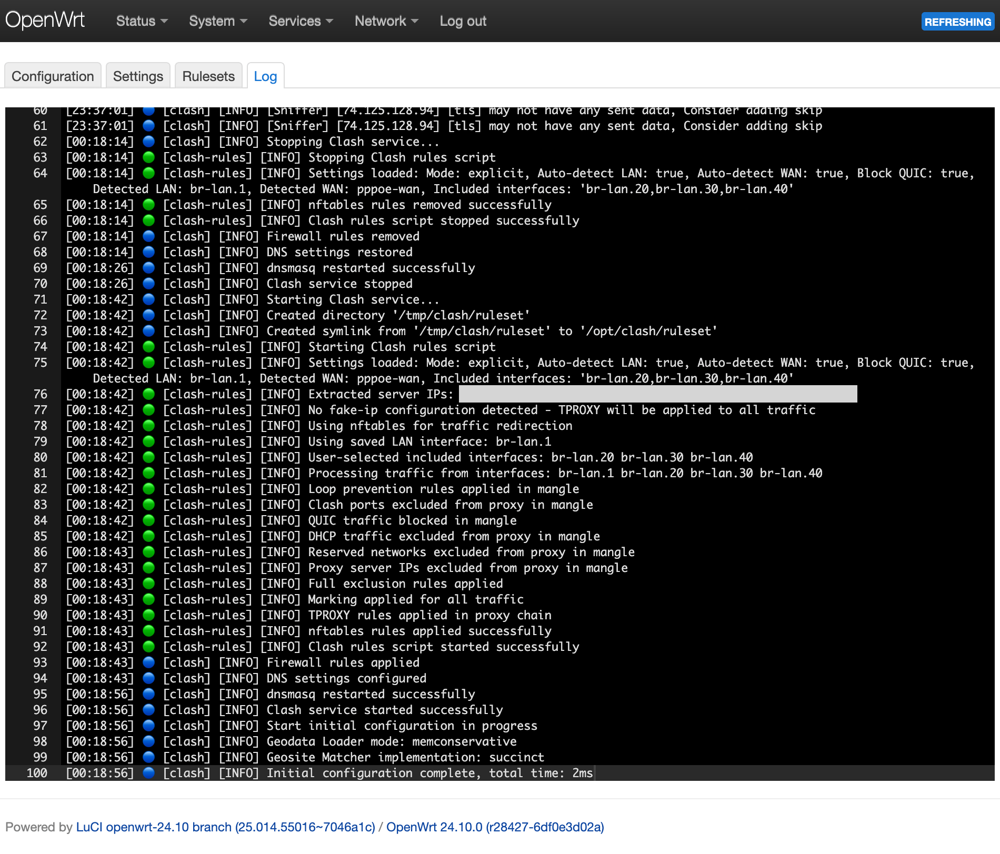

📖 Read this in other languages:
- [Русский](README.ru.md)

<p align="center">
 
</p>

<h3 align="center">Here's the step-by-step process for installing and configuring SSClash on your OpenWrt router</h3>

# Setup Guide

## Step 1: Update Package List

Update the package list to ensure you have the latest available versions.

```bash
opkg update
```

## Step 2: Install Required Packages

Install the necessary kernel module for nftables.

```bash
opkg install kmod-nft-tproxy
```

For iptables (if you have OpenWrt version < 22.03.x) – `iptables-mod-tproxy`.

## Step 3: Download and Install `luci-app-ssclash` Package

Download the SSClash package and install it.

```bash
curl -L https://github.com/zerolabnet/ssclash/releases/download/v2.9.0/luci-app-ssclash_2.9.0-r1_all.ipk -o /tmp/luci-app-ssclash_2.9.0-r1_all.ipk
opkg install /tmp/luci-app-ssclash_2.9.0-r1_all.ipk
rm /tmp/*.ipk
```

## Step 4: Automatic Mihomo Kernel Management

Go to **Settings** → **Mihomo Kernel Management** and click **Download Latest Kernel**. The system will:

- Automatically detect your router's architecture
- Download the latest compatible Mihomo kernel
- Install and configure it properly
- Show kernel status and version information

**Important:** Restart the Clash service after kernel installation.

### Manual Kernel Installation (Optional)

If you prefer manual installation, navigate to the `bin` directory and download the Clash.Meta Kernel:

```bash
cd /opt/clash/bin
```

For **amd64** architecture:

```bash
curl -L https://github.com/MetaCubeX/mihomo/releases/download/v1.19.12/mihomo-linux-amd64-compatible-v1.19.12.gz -o clash.gz
```

For **arm64** architecture:

```bash
curl -L https://github.com/MetaCubeX/mihomo/releases/download/v1.19.12/mihomo-linux-arm64-v1.19.12.gz -o clash.gz
```

For **mipsel_24kc** architecture:

```bash
curl -L https://github.com/MetaCubeX/mihomo/releases/download/v1.19.12/mihomo-linux-mipsle-softfloat-v1.19.12.gz -o clash.gz
```

Need a different architecture? Visit the [MetaCubeX Release Page](https://github.com/MetaCubeX/mihomo/releases) and choose the one that matches your device.

Decompress and make executable:

```bash
gunzip clash.gz
chmod +x clash
```

## Step 5: Configure Interface Processing Mode

SSClash offers two interface processing modes:

### Exclude Mode (Universal approach) - **Recommended for most users**

- **Default mode** that processes traffic from ALL interfaces except selected ones
- Automatically detects and excludes WAN interface
- Simple to configure - just select interfaces to bypass proxy
- Best for typical home router setups

### Explicit Mode (Precise control) - **For advanced users**

- Processes traffic ONLY from selected interfaces
- More secure but requires manual configuration
- Automatically detects LAN bridge when enabled
- Ideal for complex network setups requiring precise control

### Additional Settings:

- **Block QUIC traffic**: Blocks UDP port 443 to improve proxy effectiveness for services like YouTube

<p align="center">
 
</p>

## Step 6: Clash Configuration Management

Edit your Clash configuration with the built-in editor featuring:

- **Syntax highlighting** for YAML files
- **Live service control** (Start/Stop/Restart)
- **Service status indicator**
- **Save & Apply** functionality with automatic service reload

<p align="center">
 
</p>

## Step 7: Local Rulesets Management

Create and manage local rule files for use with `rule-providers`:

- **Create custom rule lists** with validation
- **Edit existing rulesets** with syntax highlighting
- **Organized file management** with collapsible sections
- **Usage**: Reference in config as `type: file, format: text, path: ./lst/your_list.txt`

<p align="center">
 
</p>

## Step 8: Real-time Log Monitoring

Monitor Clash activity with the integrated log viewer:

- **Real-time log streaming** with automatic updates
- **Filtered display** showing only Clash-related entries
- **Color-coded log levels** and daemon identification
- **Auto-scroll** to latest entries

<p align="center">
 
</p>

## Step 9: Dashboard Access

Access the Clash dashboard directly from the LuCI interface with automatic configuration detection.

<p align="center">
 
</p>

# Remove Clash

To remove Clash completely:

```bash
opkg remove luci-app-ssclash kmod-nft-tproxy
rm -rf /opt/clash
```

---

# Extra Info (optional): Automating Clash Rules Update

To automatically update Clash rules when the Internet interface comes up:

## Create the Hotplug Script

1. Create the script in `/etc/hotplug.d/iface/40-clash_rules`:
```bash
vi /etc/hotplug.d/iface/40-clash_rules
```

2. Add the following content:
```sh
#!/bin/sh

# Add delay
sleep 10

# API IP address and port
api_base_url="http://192.168.1.1:9090"

# API URL
base_url="$api_base_url/providers/rules"

# Get JSON response with provider names
response=$(curl -s "$base_url")

# Extract provider names using standard utilities
providers=$(echo "$response" | grep -o '"name":"[^"]*"' | sed 's/"name":"\([^"]*\)"/\1/')

# Check if data retrieval was successful
if [ -z "$providers" ]; then
  echo "Failed to retrieve providers or no providers found."
  exit 1
fi

# Loop through each provider name and send PUT request to update
for provider in $providers; do
  echo "Updating provider: $provider"
  curl -X PUT "$base_url/$provider"

  # Check success and output the result
  if [ $? -eq 0 ]; then
    echo "Successfully updated $provider"
  else
    echo "Failed to update $provider"
  fi
done

# Service restart
/etc/init.d/clash reload
```

3. Save and exit the editor.

This script automatically updates rule providers whenever the Internet interface comes up, ensuring rules are refreshed after router reboots.
