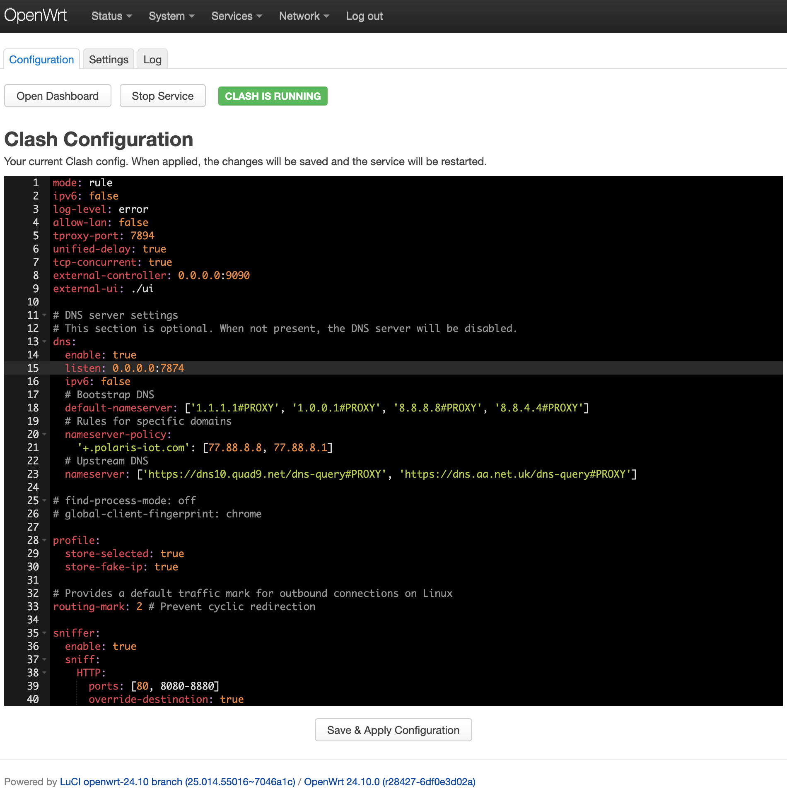
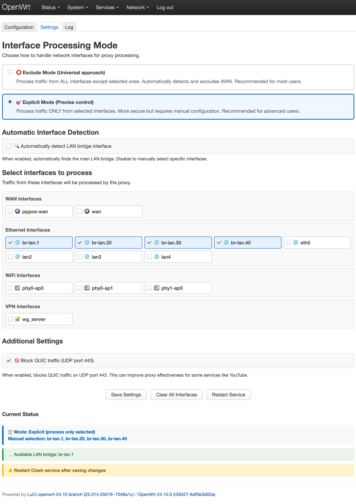
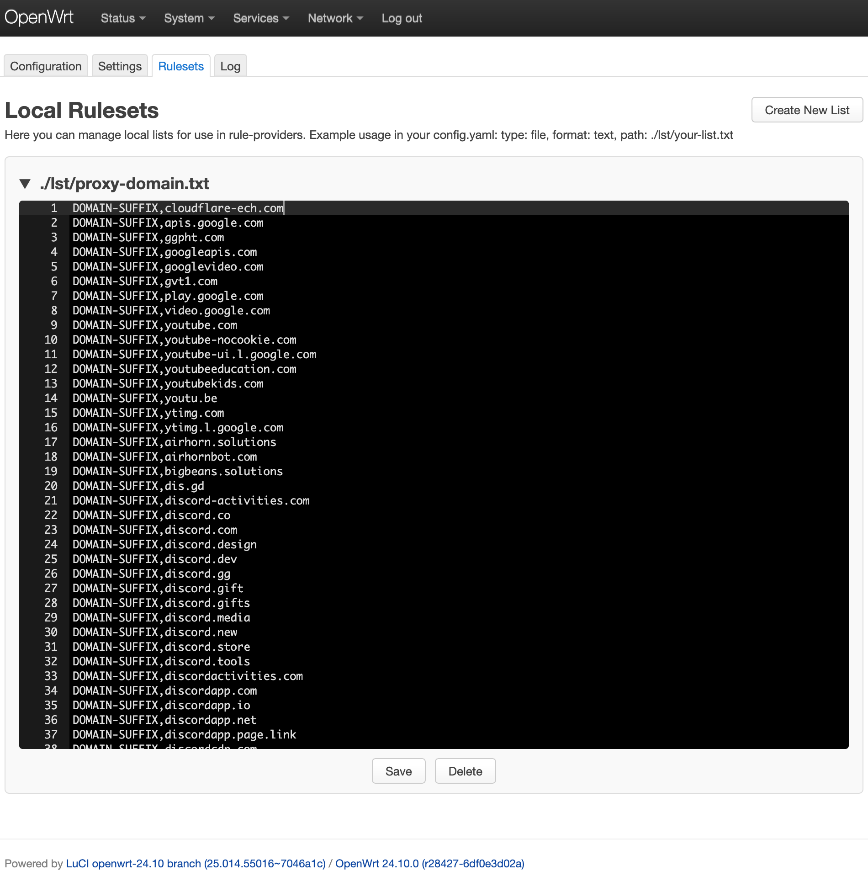

<h3 align="center">Here's the step-by-step process for installing and configuring SSClash on your OpenWrt router</h3>

# Setup Guide

## Step 1: Update Package List
Update the package list to ensure you have the latest available versions.

```bash
opkg update
```

## Step 2: Install Required Packages
Install the necessary kernel module for nftables.

```bash
opkg install kmod-nft-tproxy
```

For iptables (if you have OpenWrt version < 22.03.x) – `iptables-mod-tproxy`.

## Step 3: Download and Install `luci-app-ssclash` Package
Download the SSClash package and install it.

```bash
curl -L https://github.com/zerolabnet/ssclash/releases/download/v2.6.0/luci-app-ssclash_2.6.0-1_all.ipk -o /tmp/luci-app-ssclash_2.6.0-1_all.ipk
opkg install /tmp/luci-app-ssclash_2.6.0-1_all.ipk
rm /tmp/*.ipk
```

## Step 4: Download Clash.Meta Kernel
Navigate to the `bin` directory and download the Clash.Meta Kernel. Choose the appropriate architecture.

```bash
cd /opt/clash/bin
```

For **amd64** architecture:

```bash
curl -L https://github.com/MetaCubeX/mihomo/releases/download/v1.19.11/mihomo-linux-amd64-compatible-v1.19.11.gz -o clash.gz
```

For **arm64** architecture:

```bash
curl -L https://github.com/MetaCubeX/mihomo/releases/download/v1.19.11/mihomo-linux-arm64-v1.19.11.gz -o clash.gz
```

For **mipsel_24kc** architecture:

```bash
curl -L https://github.com/MetaCubeX/mihomo/releases/download/v1.19.11/mihomo-linux-mipsle-softfloat-v1.19.11.gz -o clash.gz
```

Need a different architecture? Visit the [MetaCubeX Release Page](https://github.com/MetaCubeX/mihomo/releases) and choose the one that matches your device.

## Step 5: Prepare the Clash Binary
Decompress the downloaded file and make it executable.

```bash
gunzip clash.gz
chmod +x clash
```

## Step 6: Managing Clash from LuCI interface
I've written a simple interface for managing Clash from LuCI interface `luci-app-ssclash`. Edit Clash config and Apply.

<p align="center">
 
</p>

Select network interfaces to exclude from proxy. These interfaces will use direct routing (bypass proxy). WAN interface is automatically detected and excluded.

<p align="center">
 
</p>

## Step 7: You can access to Dashboard from LuCI interface or manual
You can access the Dashboard at:

```
http://ROUTER_IP:9090/ui/
```

<p align="center">
 
</p>

# Remove Clash
To remove Clash, delete the related files, `luci-app-ssclash` package and kernel module `kmod-nft-tproxy` or `iptables-mod-tproxy`.

```bash
opkg remove luci-app-ssclash kmod-nft-tproxy
rm -rf /opt/clash
```

---

# Extra info (optional): Automating Clash Rules Update in OpenWrt whenever the Internet interface is brought up

To automatically update the rules for Clash whenever the Internet interface is brought up in OpenWrt, follow these step:

## Create the Shell Script

1. Open a terminal and create a new shell script named `40-clash_rules` in the `/etc/hotplug.d/iface/` directory:

```bash
vi /etc/hotplug.d/iface/40-clash_rules
```

2. [Insert the following script content](https://raw.githubusercontent.com/zerolabnet/ssclash/main/update_all_rule_providers.sh) (change `api_base_url` if needed):

```sh
#!/bin/sh

# Add delay
sleep 10

# API IP address and port
api_base_url="http://192.168.1.1:9090"

# API URL
base_url="$api_base_url/providers/rules"

# Get JSON response with provider names
response=$(curl -s "$base_url")

# Extract provider names using standard utilities
providers=$(echo "$response" | grep -o '"name":"[^"]*"' | sed 's/"name":"\([^"]*\)"/\1/')

# Check if data retrieval was successful
if [ -z "$providers" ]; then
  echo "Failed to retrieve providers or no providers found."
  exit 1
fi

# Loop through each provider name and send PUT request to update
for provider in $providers; do
  echo "Updating provider: $provider"
  curl -X PUT "$base_url/$provider"

  # Check success and output the result
  if [ $? -eq 0 ]; then
    echo "Successfully updated $provider"
  else
    echo "Failed to update $provider"
  fi
done

# Service restart
/etc/init.d/clash reload
```

3. Save and exit the editor.

The script will now automatically run whenever the Internet interface is brought up. This ensures that the rules for Clash are updated as soon as the router is rebooted and connected to the Internet.
