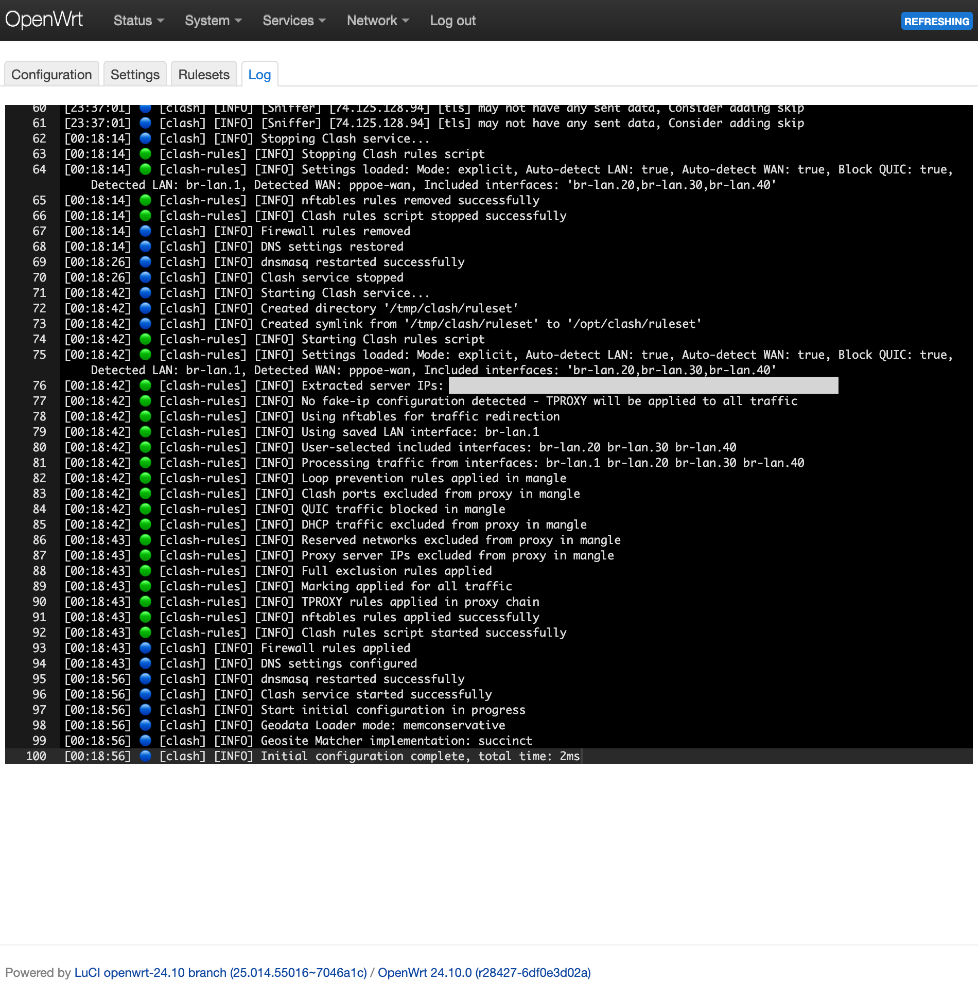

<h3 align="center">Пошаговая инструкция по установке и настройке SSClash на вашем роутере с OpenWrt</h3>

# Руководство по установке

## Шаг 1: Обновление списка пакетов

Обновите список пакетов, чтобы у вас были последние доступные версии.

```bash
opkg update
```


## Шаг 2: Установка необходимых пакетов

Установите необходимый модуль ядра для nftables.

```bash
opkg install kmod-nft-tproxy
```

Для iptables (если у вас OpenWrt версии < 22.03.x) – `iptables-mod-tproxy`.

## Шаг 3: Загрузка и установка пакета `luci-app-ssclash`

Загрузите пакет SSClash и установите его.

```bash
curl -L https://github.com/zerolabnet/ssclash/releases/download/v2.8.1/luci-app-ssclash_2.8.1-1_all.ipk -o /tmp/luci-app-ssclash_2.8.1-1_all.ipk
opkg install /tmp/luci-app-ssclash_2.8.1-1_all.ipk
rm /tmp/*.ipk
```


## Шаг 4: Автоматическое управление ядром Mihomo

Перейдите в **Настройки** → **Управление ядром Mihomo** и нажмите **Загрузить последнее ядро**. Система:

* Автоматически определит архитектуру вашего роутера
* Загрузит последнее совместимое ядро Mihomo
* Правильно установит и настроит его
* Покажет статус и версию ядра

**Важно:** Перезапустите службу Clash после установки ядра.

### Ручная установка ядра (необязательно)

Если вы предпочитаете ручную установку, перейдите в каталог `bin` и загрузите ядро Clash.Meta:

```bash
cd /opt/clash/bin
```

Для архитектуры **amd64**:

```bash
curl -L https://github.com/MetaCubeX/mihomo/releases/download/v1.19.12/mihomo-linux-amd64-compatible-v1.19.12.gz -o clash.gz
```

Для архитектуры **arm64**:

```bash
curl -L https://github.com/MetaCubeX/mihomo/releases/download/v1.19.12/mihomo-linux-arm64-v1.19.12.gz -o clash.gz
```

Для архитектуры **mipsel\_24kc**:

```bash
curl -L https://github.com/MetaCubeX/mihomo/releases/download/v1.19.12/mihomo-linux-mipsle-softfloat-v1.19.12.gz -o clash.gz
```

Нужна другая архитектура? Посетите [страницу релизов MetaCubeX](https://github.com/MetaCubeX/mihomo/releases) и выберите ту, которая соответствует вашему устройству.

Распакуйте и сделайте исполняемым:

```bash
gunzip clash.gz
chmod +x clash
```


## Шаг 5: Настройка режима обработки интерфейсов

SSClash предлагает два режима обработки интерфейсов:

### Режим исключения (Универсальный подход) - **Рекомендуется для большинства пользователей**

* **Режим по умолчанию**, который обрабатывает трафик со ВСЕХ интерфейсов, кроме выбранных
* Автоматически определяет и исключает WAN-интерфейс
* Прост в настройке - просто выберите интерфейсы для обхода прокси
* Лучше всего подходит для типичных домашних роутеров


### Явный режим (Точный контроль) - **Для продвинутых пользователей**

* Обрабатывает трафик ТОЛЬКО с выбранных интерфейсов
* Более безопасен, но требует ручной настройки
* Автоматически определяет LAN-мост при включении
* Идеально подходит для сложных сетевых конфигураций, требующих точного контроля


### Дополнительные настройки:

* **Блокировать QUIC-трафик**: Блокирует UDP-порт 443 для повышения эффективности прокси для таких сервисов, как YouTube

<p align="center">
 
</p>

## Шаг 6: Управление конфигурацией Clash

Редактируйте свою конфигурацию Clash с помощью встроенного редактора, который включает:

* **Подсветку синтаксиса** для YAML-файлов
* **Управление службой в реальном времени** (Запуск/Остановка/Перезапуск)
* **Индикатор состояния службы**
* Функциональность **Сохранить и применить** с автоматической перезагрузкой службы

<p align="center">
 
</p>

## Шаг 7: Управление локальными наборами правил

Создавайте и управляйте локальными файлами правил для использования с `rule-providers`:

* **Создание пользовательских списков правил** с проверкой
* **Редактирование существующих наборов правил** с подсветкой синтаксиса
* **Организованное управление файлами** со сворачиваемыми разделами
* **Использование**: Ссылка в конфигурации как `type: file, format: text, path: ./lst/your_list.txt`

<p align="center">
 
</p>

## Шаг 8: Мониторинг логов в реальном времени

Отслеживайте активность Clash с помощью встроенного просмотрщика логов:

* **Потоковая передача логов в реальном времени** с автоматическим обновлением
* **Фильтрованное отображение**, показывающее только записи, связанные с Clash
* **Цветовая кодировка уровней логов** и идентификация демона
* **Автоматическая прокрутка** к последним записям

<p align="center">
 
</p>

## Шаг 9: Доступ к панели управления

Получите доступ к панели управления Clash прямо из интерфейса LuCI с автоматическим определением конфигурации.

<p align="center">
 
</p>

# Удаление Clash

Чтобы полностью удалить Clash:

```bash
opkg remove luci-app-ssclash kmod-nft-tproxy
rm -rf /opt/clash
```


# Дополнительная информация (необязательно): Автоматизация обновления правил Clash

Чтобы автоматически обновлять правила Clash при включении интернет-интерфейса:

## Создайте скрипт Hotplug

1. Создайте скрипт в `/etc/hotplug.d/iface/40-clash_rules`:
```bash
vi /etc/hotplug.d/iface/40-clash_rules
```

2. Добавьте следующее содержимое:
```sh
#!/bin/sh

# Добавить задержку
sleep 10

# IP-адрес и порт API
api_base_url="http://192.168.1.1:9090"

# URL API
base_url="$api_base_url/providers/rules"

# Получить JSON-ответ с именами провайдеров
response=$(curl -s "$base_url")

# Извлечь имена провайдеров с помощью стандартных утилит
providers=$(echo "$response" | grep -o '"name":"[^"]*"' | sed 's/"name":"\([^"]*\)"/\1/')

# Проверить, успешно ли были получены данные
if [ -z "$providers" ]; then
  echo "Не удалось получить данные или провайдеры не найдены."
  exit 1
fi

# Пройтись по каждому имени провайдера и отправить PUT-запрос для обновления
for provider in $providers; do
  echo "Обновление провайдера: $provider"
  curl -X PUT "$base_url/$provider"

  # Проверить успешность и вывести результат
  if [ $? -eq 0 ]; then
    echo "Успешно обновлен $provider"
  else
    echo "Не удалось обновить $provider"
  fi
done

# Перезапуск службы
/etc/init.d/clash reload
```

3. Сохраните и выйдите из редактора.

Этот скрипт автоматически обновляет провайдеров правил всякий раз, когда включается интернет-интерфейс, обеспечивая обновление правил после перезагрузки роутера.
